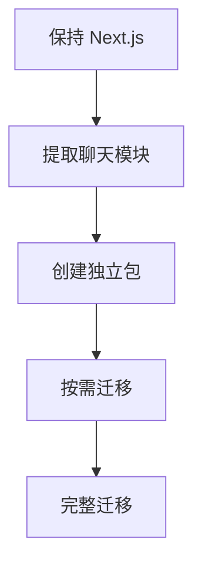

# LobeHub Chat 框架移植变动分析## 🎯 概述将 LobeHub 聊天功能移植到新框架时，框架层面的变动主要涉及技术栈迁移、构建配置调整和项目结构重组。本分析基于当前 LobeHub 的技术栈进行详细拆解## 📊 当前框架技术栈### **核心框架**

```json
{
  "框架": "Next.js 16.1.5 (App Router)",
  "React": "19.2.3",
  "TypeScript": "5.7.2",
  "包管理器": "pnpm workspace",
  "构建工具": "Next.js + Vite + Turborepo",
  "运行时": "Node.js + Bun"
}
```

### **数据库与状态管理**

```json
{
  "数据库": "Drizzle ORM + PostgreSQL",
  "状态管理": "Zustand",
  "UI组件": "Ant Design + Tailwind CSS",
  "国际化": "react-i18next",
  "主题": "CSS Variables + Tailwind"
}
```

## 🔄 框架移植变动矩阵

### **1. 移植到 Remix** (推荐 - 中等变动)

#### **变动程度**: 🔴🔴⚪⚪⚪ (2/5)

#### **主要变动**

### ✅ 保持不变

```typescript
// 路由结构基本兼容
// app/routes/ -> app/routes/
// React 组件可直接复用
// TypeScript 配置基本相同
```

### 🔄 需要调整

```ts
// remix.config.ts (替代 next.config.ts)
import { defineConfig } from "@remix-run/dev";

export default defineConfig({
  // 类似 Next.js 的配置
  serverDependenciesToBundle: [
    // 排除大型包
  ],
});
```

### ❌ 需要重写

```typescript
// API Routes: pages/api/ -> app/routes/api/
// getServerSideProps -> loader functions
// getStaticProps -> loader functions
```

#### **具体实施步骤**

```bash
# 1. 创建 Remix 项目
npx create-remix@latest chat-remix --template remix-app-template

# 2. 复制 LobeHub 源码
cp -r /path/to/lobehub/src/* ./app/
cp -r /path/to/lobehub/packages/database ./packages/

# 3. 调整 API 路由
# app/api/chat/route.ts -> app/routes/api.chat.ts

# 4. 更新依赖
npm install @remix-run/node @remix-run/react
npm uninstall next @next/font
```

### **2. 移植到 Nuxt.js/Vue**

#### **变动程度**: 🔴🔴🔴🔴⚪ (4/5)

#### **主要变动**:

**❌ 完全重写**

```typescript
// React -> Vue 组件重写 (50+ 组件)
// src/features/ChatInput/ -> 全部重写
// src/store/chat/ -> Pinia/Vuex
// JSX -> Vue SFC
```

**🔄 架构调整**

```typescript
// pages/ -> pages/
// server/api/ -> server/api/
// composables/ -> composables/
```

**✅ 可复用**

```typescript
// 数据库模型 (packages/database/)
// API 逻辑 (src/server/)
// 类型定义 (packages/types/)
```

#### **具体实施步骤**

```bash
# 1. 创建 Nuxt 项目
npx nuxi@latest init chat-nuxt

# 2. 安装 Vue 生态
npm install @nuxtjs/tailwindcss @pinia/nuxt
npm install pinia vue-i18n

# 3. 重写 React 组件为 Vue
# src/components/ChatInput.tsx -> components/ChatInput.vue

# 4. 迁移状态管理
# Zustand -> Pinia store
```

### **3. 移植到 SvelteKit**

#### **变动程度**: 🔴🔴🔴🔴🔴 (5/5)

#### **主要变动**:

**❌ 完全重写**

```typescript
// React -> Svelte 组件 (学习曲线陡峭)
// JSX -> Svelte 模板语法
// React Hooks -> Svelte stores/runes
// 生态系统差异大
```

**🔄 架构调整**

```typescript
// src/routes/ -> src/routes/
// src/lib/ -> src/lib/
// package.json scripts 重写
```

#### **具体实施步骤**

```bash
# 1. 创建 SvelteKit 项目
npm create svelte@latest chat-svelte

# 2. 学习 Svelte 语法和概念
# Svelte 组件语法
# Stores 和 runes
# SvelteKit 路由

# 3. 重写所有组件
# React 组件 -> Svelte 组件

# 4. 重写状态管理
# Zustand -> Svelte stores
```

### **4. 移植到 SolidJS**

#### **变动程度**: 🔴🔴🔴⚪⚪ (3/5)

#### **主要变动**:

**🔄 需要调整**

```typescript
// React Hooks -> SolidJS primitives
// useState -> createSignal
// useEffect -> createEffect
// JSX 语法基本兼容
```

**✅ 大部分复用**

```typescript
// 组件结构相似
// TypeScript 配置相同
// 包管理器可保持 pnpm
```

#### **具体实施步骤**

```bash
# 1. 创建 Vite + SolidJS 项目
npm create vite@latest chat-solid -- --template solid-ts

# 2. 迁移 React Hooks
# useState -> createSignal
# useEffect -> createEffect

# 3. 调整组件写法
# SolidJS 的响应式写法

# 4. 性能优化
# SolidJS 的细粒度更新
```

### **5. 移植到 NestJS (后端框架)**

#### **变动程度**: 🔴🔴🔴⚪⚪ (3/5)

#### **主要变动**:

### ✅ 保持前端

```typescript
// 前端组件完全不变
// 聊天界面保持原样
// 状态管理不变
```

### ❌ 重写后端

```typescript
// Next.js API Routes -> NestJS Controllers
// src/server/routers/ -> src/controllers/
// 中间件重写
// 依赖注入重构
```

#### **具体实施步骤**

```bash
# 1. 创建 NestJS 项目
npm i -g @nestjs/cli
nest new chat-nest

# 2. 安装数据库相关
npm install @nestjs/typeorm typeorm pg
npm install drizzle-orm

# 3. 创建控制器
# Next.js API -> NestJS Controller

# 4. 配置模块
# 依赖注入配置
```

### **6. 移植到 Vite + React (纯前端)**

#### **变动程度**: 🔴🔴⚪⚪⚪ (2/5)

#### **主要变动**:

### ✅ 大部分复用

```typescript
// React 组件直接可用
// TypeScript 配置相同
// 状态管理不变
```

### 🔄 需要调整

```typescript
// 移除 Next.js 特定功能
// API 调用改为 fetch
// 路由改为 React Router
// SSR 改为 CSR
```

### ❌ 需要重写

```typescript
// 服务器端功能移除
// 数据库直连改为 API 调用
// 文件上传处理
```

#### **具体实施步骤**

```bash
# 1. 创建 Vite + React 项目
npm create vite@latest chat-vite -- --template react-ts

# 2. 安装路由
npm install react-router-dom

# 3. 配置路由
# Next.js App Router -> React Router

# 4. 调整 API 调用
# 相对路径 API -> 绝对路径 API
```

## 🛠️ 通用框架变动清单

### **构建配置变动**

#### **1. 构建工具配置**

```typescript
// 移除: next.config.ts
// 新增: vite.config.ts 或 remix.config.ts 或 nuxt.config.ts

// 构建脚本调整
{
  "scripts": {
    "build": "tsc && vite build",     // Vite
    "build": "remix build",           // Remix
    "build": "nuxt build",            // Nuxt
    "build": "nest build",            // NestJS
  }
}
```

#### **2. TypeScript 配置**

```json
// tsconfig.json 调整
{
  "compilerOptions": {
    "jsx": "react-jsx", // React
    "jsx": "preserve", // Vue
    "jsx": "react-jsx" // SolidJS
  },
  "include": [
    "src/**/*", // 通用
    "packages/**/*" // monorepo
  ]
}
```

#### **3. 路径别名调整**

```typescript
// vite.config.ts
export default defineConfig({
  resolve: {
    alias: {
      "@": path.resolve(__dirname, "./src"),
      "@/database": path.resolve(__dirname, "./packages/database/src"),
    },
  },
});
```

### **包管理器变动**

#### **1. 从 pnpm 迁移到其他包管理器**

```bash
# 保持 pnpm (推荐)
pnpm install

# 迁移到 yarn
rm pnpm-lock.yaml
yarn install

# 迁移到 npm
rm pnpm-lock.yaml
npm install
```

#### **2. workspace 配置调整**

```json
// package.json
{
  "workspaces": ["packages/*", "apps/*"]
}

// 不同包管理器的 workspace 配置
// pnpm-workspace.yaml (pnpm)
// yarn.lock + package.json workspaces (yarn)
// package.json workspaces (npm)
```

### **项目结构变动**

#### **1. 目录结构调整**

关键是要根据项目需求、团队技能和时间预算来选择合适的框架。渐进式迁移策略可以降低风险，逐步完成框架升级。

```
# Next.js 结构
src/
├── app/              # App Router
├── components/
├── lib/
└── server/

# Remix 结构
app/
├── routes/           # 路由
├── components/
└── lib/

# Nuxt 结构
├── pages/            # 页面路由
├── components/
├── composables/
└── server/

# NestJS 结构
src/
├── controllers/      # API 控制器
├── services/         # 业务逻辑
├── modules/          # 模块
└── dto/             # 数据传输对象
```

#### **2. 路由系统调整**

```typescript
// Next.js App Router
app/
├── layout.tsx
├── page.tsx
└── api/
    └── chat/
        └── route.ts

// Remix Routes
app/
├── root.tsx
├── routes/
│   ├── _index.tsx
│   └── api.chat.ts
└── components/

// Nuxt Pages
pages/
├── index.vue
└── api/
    └── chat.post.ts
```

### **依赖包变动**

#### **1. 框架核心依赖**

```json
// Next.js
{
  "next": "^16.1.5",
  "react": "^19.2.3",
  "react-dom": "^19.2.3"
}

// Remix
{
  "@remix-run/node": "^2.8.1",
  "@remix-run/react": "^2.8.1",
  "react": "^18.2.0",
  "react-dom": "^18.2.0"
}

// Nuxt
{
  "nuxt": "^3.11.0",
  "vue": "^3.4.0"
}

// SolidJS
{
  "solid-js": "^1.8.0",
  "vite-plugin-solid": "^2.8.0"
}
```

#### **2. 构建工具依赖**

```json
// Vite (通用)
{
  "vite": "^5.0.0",
  "@vitejs/plugin-react": "^4.2.0",
  "typescript": "^5.3.0"
}

// Turborepo (可选)
{
  "turbo": "^1.11.0"
}
```

#### **3. 开发工具依赖**

```json
// ESLint 配置调整
{
  "eslint-config-next": "next/core-web-vitals", // Next.js
  "@remix-run/eslint-config": "^2.8.1", // Remix
  "@nuxt/eslint-config": "^0.6.0" // Nuxt
}
```

## � 小范围迁移：只移动 Chat 模块

### 目标

先做最小可行的迁移：仅将聊天功能拆成独立模块或独立服务，保持其它业务模块在现有系统中不变。

### 适用场景

- 仅需要验证 chat 模块迁移可行性
- 不希望一次性迁移整个系统
- 先提取聊天功能，后续再逐步迁移其它模块

### 方案概要

1. **拆分 chat 包**
   - 提取 `chat-ui`、`chat-store`、`chat-api`、`chat-db` 和 `chat-adapters`
   - 保持现有 Next.js 框架和非聊天功能不变
2. **保留现有主应用**
   - 先不迁移认证、权限、后台管理、页面路由等非聊天功能
3. **只迁移聊天接口**
   - 将 chat API 路由迁移到新项目或新服务
   - 新项目通过 API 或 SDK 与现有系统集成
4. **逐步替换**
   - 先完成聊天 UI 与核心消息流程
   - 再按需扩展到会话管理、消息历史、插件能力

### 实施时间

- 1-2 天：提取 chat 核心包、搭建独立项目
- 2-3 天：迁移 UI、状态、API 与数据库模型
- 1-2 天：完成集成测试与联调

### 关键优势

- 最小化风险：只迁移一个模块，影响面小
- 迭代快：快速交付可运行的聊天功能
- 可回滚：主应用保持原样，问题可控
- 可复用：chat 功能将来可直接复用到其他项目

### 推荐执行方式

- **快速落地**：先用 `Next.js` 或 `Vite + React` 建一个独立 chat 项目
- **后端稳定**：仅迁移前端组件与 chat API，后端继续由现有系统提供数据
- **提高复用性**：构建独立 `@your-project/chat` 包，后续逐步替换现有聊天模块

### 结论

“先小一点，先只移动 chat”是最稳妥的策略。它让你在保证现有系统稳定的前提下，优先实现聊天功能的独立迁移和复用。

## �🚀 推荐移植策略

### **策略一: 渐进式迁移** (推荐)

``mermaid
graph TD
A[保持 Next.js] --> B[提取聊天模块]
B --> C[创建独立包]
C --> D[按需迁移]
D --> E[完整迁移]

```

### **策略二: 重写迁移**
``mermaid
graph TD
    A[选择目标框架] --> B[搭建新项目]
    B --> C[移植数据库层]
    C --> D[移植聊天组件]
    D --> E[移植 API]
    E --> F[测试集成]
```

### **策略三: 混合架构**

``mermaid
graph TD
A[前端保持 React] --> B[后端迁移到 NestJS]
B --> C[API 层重构]
C --> D[数据库层优化]
D --> E[部署架构调整]

````

## 📊 性能对比分析

### **1. 运行时性能**

| 框架 | 首屏加载 | 交互响应 | 内存占用 | 构建速度 |
|------|----------|----------|----------|----------|
| Next.js | 中等 | 快 | 中等 | 中等 |
| Remix | 快 | 快 | 低 | 快 |
| Nuxt | 中等 | 中等 | 中等 | 中等 |
| SolidJS | 快 | 极快 | 低 | 快 |
| SvelteKit | 快 | 快 | 低 | 快 |
| NestJS | - | 快 | 低 | 中等 |

### **2. 开发体验**

| 框架 | 热重载 | 类型支持 | 调试友好 | 社区支持 |
|------|--------|----------|----------|----------|
| Next.js | 优秀 | 优秀 | 优秀 | 优秀 |
| Remix | 优秀 | 优秀 | 优秀 | 良好 |
| Nuxt | 优秀 | 良好 | 良好 | 优秀 |
| SolidJS | 良好 | 优秀 | 良好 | 良好 |
| SvelteKit | 良好 | 良好 | 良好 | 良好 |
| NestJS | 良好 | 优秀 | 优秀 | 优秀 |

## 💰 成本分析

### **1. 人力成本**

| 框架 | 开发成本 | 维护成本 | 培训成本 | 总成本评估 |
|------|----------|----------|----------|------------|
| Remix | 低 | 低 | 低 | ⭐⭐⭐⭐⭐ |
| SolidJS | 中 | 低 | 中 | ⭐⭐⭐⭐ |
| Vite+React | 低 | 低 | 低 | ⭐⭐⭐⭐ |
| NestJS | 中 | 中 | 中 | ⭐⭐⭐⭐ |
| Nuxt | 高 | 中 | 高 | ⭐⭐⭐ |
| SvelteKit | 高 | 中 | 高 | ⭐⭐⭐ |

### **2. 基础设施成本**

| 框架 | 部署复杂度 | 服务器成本 | CDN 需求 | 扩展性 |
|------|------------|------------|----------|--------|
| Next.js | 中等 | 中等 | 高 | 优秀 |
| Remix | 低 | 低 | 中等 | 优秀 |
| Nuxt | 中等 | 中等 | 高 | 优秀 |
| SolidJS | 低 | 低 | 低 | 良好 |
| SvelteKit | 低 | 低 | 中等 | 良好 |
| NestJS | 中等 | 低 | 低 | 优秀 |

## 🛡️ 风险评估与应对

### **1. 技术风险**

#### **高风险框架**
- **SvelteKit**: 学习曲线陡峭，生态相对不成熟
- **Nuxt/Vue**: 大量组件重写，工作量巨大
- **应对策略**: 分阶段迁移，逐步替换

#### **中风险框架**
- **SolidJS**: 概念转变，需要适应响应式思维
- **NestJS**: 架构重构，依赖注入学习成本
- **应对策略**: 原型验证，小范围试点

#### **低风险框架**
- **Remix**: 与 Next.js 相似，平滑迁移
- **Vite+React**: 保持技术栈，最小化变更
- **应对策略**: 直接迁移，风险可控

### **2. 业务风险**

#### **功能完整性**
- 确保所有聊天功能正常工作
- 数据库迁移无数据丢失
- API 接口向后兼容

#### **性能影响**
- 监控关键性能指标
- 准备性能优化方案
- A/B 测试验证效果

### **3. 团队风险**

#### **技能适应**
- 评估团队学习能力
- 提供培训和文档
- 考虑外部咨询支持

#### **时间压力**
- 制定详细的项目计划
- 设置里程碑和检查点
- 准备应急预案

## 🧪 测试策略

### **1. 迁移测试流程**

```mermaid
graph TD
    A[代码迁移] --> B[单元测试]
    B --> C[集成测试]
    C --> D[端到端测试]
    D --> E[性能测试]
    E --> F[用户验收测试]
````

### **2. 测试覆盖范围**

#### **单元测试**

```typescript
// 组件测试保持
// 工具函数测试保持
// 业务逻辑测试保持
```

#### **集成测试**

```typescript
// API 接口测试
// 数据库操作测试
// 第三方服务集成测试
```

#### **端到端测试**

```typescript
// 用户交互流程测试
// 跨页面功能测试
// 错误处理测试
```

### **3. 自动化测试**

```json
// 测试配置保持
{
  "test": "vitest",
  "test:e2e": "playwright test",
  "test:coverage": "vitest --coverage"
}
```

## 🔄 回滚计划

### **1. 分阶段回滚**

#### **代码层面**

```bash
# Git 回滚
git reset --hard HEAD~1
git push --force-with-lease

# 分支策略
# main: 稳定版本
# migration: 迁移分支
# feature/*: 功能分支
```

#### **数据层面**

```sql
-- 数据库备份
pg_dump chat_db > backup.sql

-- 回滚脚本
-- 准备数据迁移脚本
-- 确保数据一致性
```

#### **配置层面**

```bash
# 环境变量回滚
cp .env.backup .env

# 构建配置回滚
git checkout HEAD~1 -- next.config.js
```

### **2. 应急预案**

#### **快速回滚清单**

- [ ] 数据库备份可用
- [ ] 代码分支完整
- [ ] 环境配置备份
- [ ] 第三方服务密钥
- [ ] 用户通知模板

#### **监控指标**

- [ ] 应用健康检查
- [ ] 错误率监控
- [ ] 性能指标监控
- [ ] 用户反馈收集

## 👥 团队协作建议

### **1. 沟通计划**

#### **内部沟通**

- 每日站会同步进度
- 周会汇报里程碑
- 风险及时上报

#### **利益相关者**

- 定期进度汇报
- 关键决策参与
- 验收标准确认

### **2. 知识分享**

#### **文档化**

- 迁移决策记录
- 技术方案文档
- 问题解决方案

#### **培训**

- 新技术栈培训
- 最佳实践分享
- 代码审查规范

### **3. 质量保障**

#### **代码审查**

- 迁移代码必须审查
- 自动化检查通过
- 性能指标达标

#### **验收标准**

- 功能完整性 100%
- 性能不低于基准
- 用户体验一致

## 🚀 推荐移植策略

### **策略一: 渐进式迁移** (推荐)



**适用场景**: 想最小化风险，逐步改进
**优势**: 风险可控，逐步优化
**时间**: 持续改进，无固定截止

### **策略二: 重写迁移**

``mermaid
graph TD
A[选择目标框架] --> B[搭建新项目]
B --> C[移植数据库层]
C --> D[移植聊天组件]
D --> E[移植 API]
E --> F[测试集成]

```

**适用场景**: 技术栈陈旧，需要全面升级
**优势**: 技术债务一次性清理
**时间**: 6-12 周，固定周期

### **策略三: 混合架构**

``mermaid
graph TD
    A[前端保持 React] --> B[后端迁移到 NestJS]
    B --> C[API 层重构]
    C --> D[数据库层优化]
    D --> E[部署架构调整]
```

**适用场景**: 前端满意，后端需要重构
**优势**: 前端稳定，后端优化
**时间**: 4-6 周，中等周期

## 📊 各框架对比表

| 框架       | 学习成本 | 迁移难度 | 生态成熟度 | 性能表现 | 推荐指数   |
| ---------- | -------- | -------- | ---------- | -------- | ---------- |
| Remix      | 低       | 低       | 高         | 优秀     | ⭐⭐⭐⭐⭐ |
| SolidJS    | 中       | 中       | 中         | 优秀     | ⭐⭐⭐⭐   |
| Vite+React | 低       | 低       | 高         | 良好     | ⭐⭐⭐⭐   |
| NestJS     | 中       | 中       | 高         | 优秀     | ⭐⭐⭐⭐   |
| Nuxt       | 高       | 高       | 高         | 良好     | ⭐⭐⭐     |
| SvelteKit  | 高       | 高       | 中         | 优秀     | ⭐⭐⭐     |

## 🎯 结论与建议

**框架移植的变动程度取决于目标框架的选择**：

- **保持 React 生态**: 变动最小 (1-3 周)
- **切换到 Vue/Nuxt**: 变动最大 (6-10 周)
- **后端框架迁移**: 中等变动 (4-6 周)

### **最终推荐**

#### **🥇 最推荐: Remix**

- **理由**: 与 Next.js 最相似，迁移成本最低
- **优势**: 保持 React 生态，性能优秀，学习成本低
- **适用**: 想升级框架但不想大幅改动

#### **🥈 备选: Vite + React**

- **理由**: 技术栈保持一致，最小化迁移风险
- **优势**: 几乎零迁移成本，现代化构建工具
- **适用**: 只想改善构建和开发体验

#### **🥉 保守选择: 渐进式迁移**

- **理由**: 不改变现有架构，逐步优化
- **优势**: 风险最小，持续改进
- **适用**: 对现有系统满意，只想小幅改进

### **决策建议**

1. **评估团队技能**: 选择团队熟悉的技术栈
2. **考虑时间预算**: 不要低估迁移的复杂性
3. **业务需求优先**: 技术选型服务于业务目标
4. **原型验证**: 小范围试点再决定大规模迁移
5. **准备回滚计划**: 迁移失败时要有应急预案

**记住**: 框架迁移不是目的，解决业务问题和提升用户体验才是根本。选择最适合团队和项目的方案，而不是最时髦的技术。
